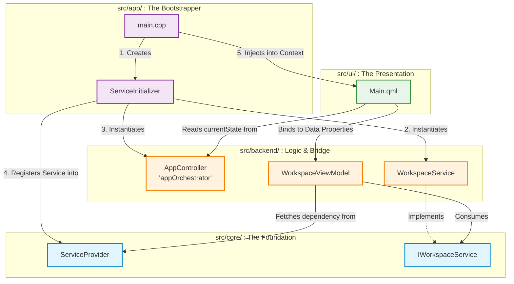
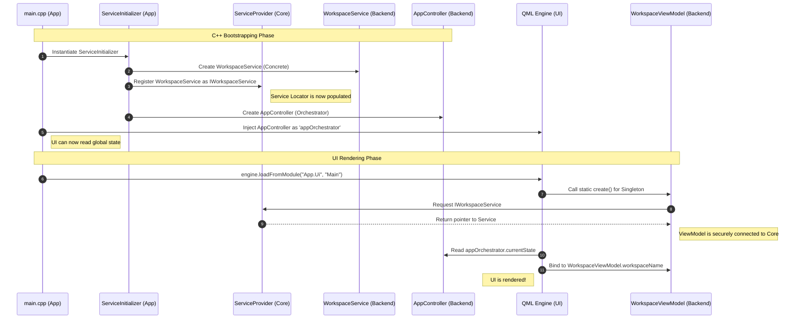

The first diagram shows the **Strict Layered Dependencies** (how the four folders relate to each other), and the second diagram maps out the exact **Initialization Lifecycle** (the chronological order of how objects are created and wired together in C++ before the UI loads).

### 1. Architectural Dependency Graph

This flowchart illustrates the "Direction of Dependencies." Notice how all arrows flow inwards toward the `Core` layer, and the `UI` layer only communicates with the `Backend/Bridge` layer, never directly with the `Core`.

### 2. Object Initialization Lifecycle

This sequence diagram shows the chronological timeline from the moment the user clicks the `.exe` to the moment the QML screen renders. It perfectly captures how you avoided a "God Object" by using a Service Locator and Dependency/Context Injection.

### Key Takeaways from the Diagrams:

1. **The App Layer is the Boss:** `main.cpp` and `ServiceInitializer` are the only files that know about *everything*. They act as the master builders, constructing the components and handing them off.
2. **The Core Layer is Blind:** The `ServiceProvider` and `IWorkspaceService` live at the bottom of the dependency tree. They do not know that Qt, QML, or the AppController exist.
3. **The Two Bridges:** The UI connects to the C++ backend through two distinct bridges. It reads global routing state from the `AppController` (injected via Context Property) , and it reads/writes specific screen data through the `WorkspaceViewModel` (instantiated via QML Singleton).